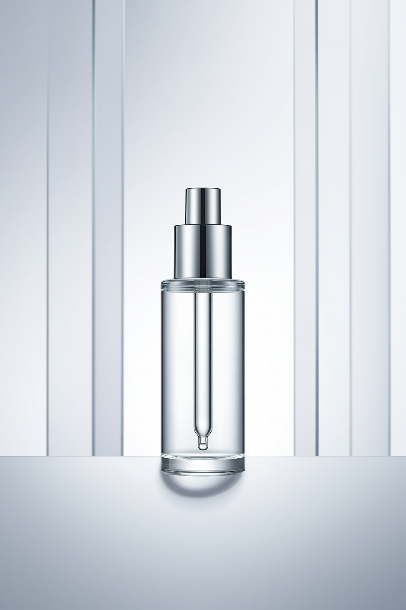
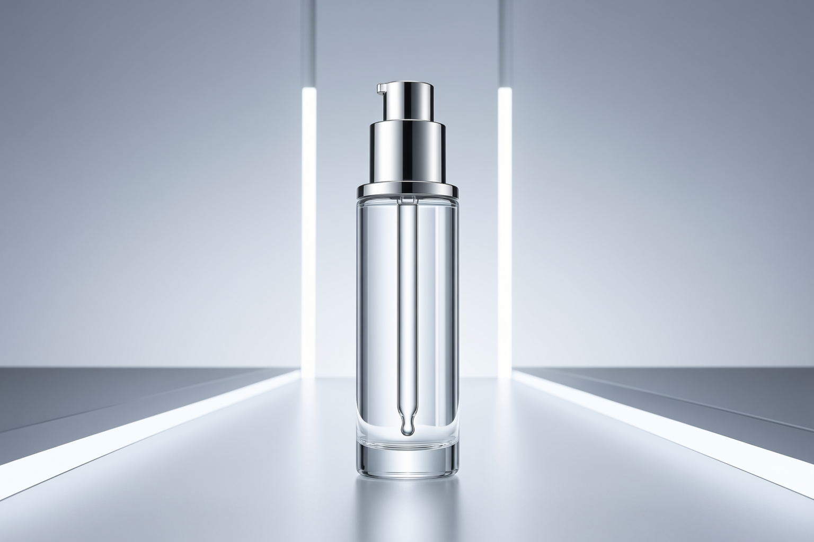
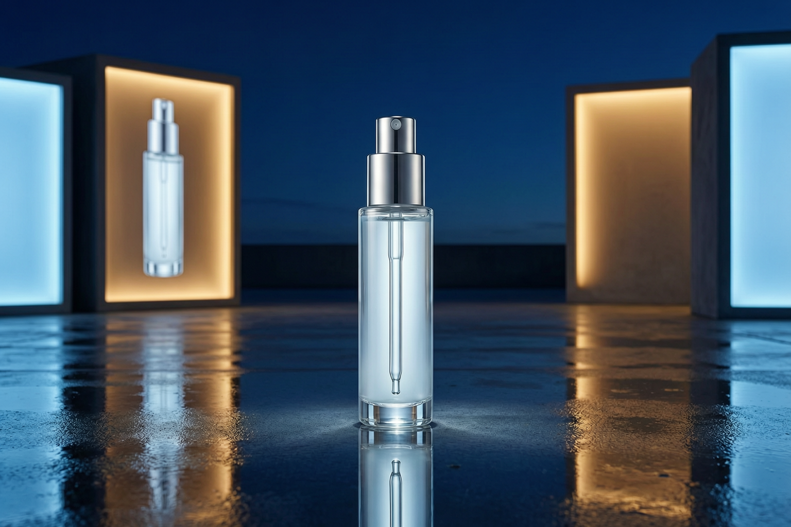

# 品牌 KV 定调助手 — Demo 文档

本文件用于展示本 Skill 在不同品牌视觉场景下的工作方式与输出结果结构。

它不是只展示“最后出了一张图”，还要展示这套 skill 比普通聊天生图多做了什么：

- 看清原始需求到底模糊在哪
- 给出几条真的不同的路线
- 推荐最稳的一条
- 解释为什么结果更像品牌主视觉
- 判断首图出来后，是该直接用、局部细改，还是回去重选路线

每个 Demo 都统一展示以下内容：

1. 原始用户 brief
2. Brief 解读
3. 视觉路线生成
4. 推荐路线
5. 执行描述
6. 最终 Wan Prompt
7. 对应价值说明
8. 下一步判断

其中：

- Demo 1、Demo 2 是主打场景
- Demo 3 仍然保留在文档里，但作为延展案例展示，不代表本 Skill 的主线
- 当前演示图统一放在 `examples/` 目录

---

# Demo 1：高端护肤 / 香氛主视觉

## 当前演示图



## 原始用户输入

> 做一张高端护肤精华海报，要高级、科技感强一点，有大牌感。

## 如果直接拿原话去生图，常见问题

- 容易只剩“科技感”和“高级感”这种空词
- 容易做成普通产品图，品牌气质不稳
- 容易冷感过头，像实验概念图，不像真正的品牌主视觉

## Brief 解读

### 任务识别
这不是单纯卖产品功能的图，首先承担的是 **品牌调性建立 + 高端感传递**，其次才是产品展示。

### 第一感受目标
观众第一眼应该感受到：
- 精密
- 洁净
- 昂贵
- 值得信任

### 视觉任务
这张图的工作不是讲很多卖点，而是先建立一种：

**“这是一支高科技、高质感、高价位护肤精华”** 的印象。

## 视觉路线生成

### 路线 A：冷感科技精密型
- 核心气质：冷静、洁净、理性、高科技实验室感
- 视觉逻辑：通过玻璃、液体、冷白光、悬浮结构和精密构图，建立“科技护肤”的可信度
- 适用原因：适合强调产品背后的科技力和成分感，更像国际高端护肤广告
- 不适合什么：不适合需要明显人味、温度感或柔和奢华氛围的 brief；容易做得太冷，像实验概念图

### 路线 B：高奢材质质感型
- 核心气质：昂贵、克制、珠宝感、奢华但不过度炫耀
- 视觉逻辑：通过高级材质、细腻反光、低饱和冷暖关系和大面积留白，建立高价位产品的精致质感
- 适用原因：适合偏品牌形象和高端人群种草，更像大牌 campaign KV
- 不适合什么：不适合用户明确要求强科技感的 brief；容易只剩“贵”，但科技可信度不够

### 路线 C：流体微观生命型
- 核心气质：柔和、流动、微观、生命感
- 视觉逻辑：通过液体、肌理、分子结构感和微距世界建立“护肤有效成分正在工作”的想象空间
- 适用原因：适合更年轻、更内容传播向的视觉表达，也更容易做社媒传播
- 不适合什么：不适合要做正式品牌主视觉定调的场景；容易更像成分传播图或社媒内容图

## 推荐路线

### 推荐：路线 A「冷感科技精密型」

推荐原因：
因为用户明确提到：
- 高级
- 科技感强
- 大牌感

路线 A 更能同时满足“科技感”和“大牌感”，也更适合主视觉场景。

为什么不推荐另外两条：
- 不选路线 B：它能做出昂贵感，但对“科技感强一点”的回应不够硬，容易更像高奢材质广告，而不是科技护肤主视觉
- 不选路线 C：它更适合内容传播和成分想象，不够像正式品牌 KV，品牌重心会变松

## 执行描述

- 主体：一支高端护肤精华瓶作为唯一主角，瓶身精致、极简、具有高端玻璃与金属细节
- 构图：中轴式或微偏心构图，主体突出，背景留白足够，画面重心稳定
- 景别 / 镜头感：中近景产品 hero shot，突出产品体积与高级轮廓
- 光线：冷白主光配合边缘轮廓光，局部高光精准打在玻璃边缘与液体质地上
- 色彩系统：冷白、银灰、低饱和冰蓝为主，局部保留微弱香槟金细节
- 材质表现：玻璃、液体、抛光金属、透明亚克力结构
- 环境：抽象实验室式空间，突出高级商业摄影空间感
- 比例建议：竖版海报优先

## 最终 Wan Prompt

```text
高端护肤精华广告主视觉，一支极简高级的精华瓶作为画面唯一主角，精致玻璃瓶身与金属细节，冷白色与银灰色主调，局部微弱香槟金高光，置于抽象未来感实验室空间中，画面洁净克制，大面积留白，稳定中轴构图，商业摄影风格，中近景 hero shot，冷白主光与轮廓边缘光精准勾勒瓶身与液体质地，透明亚克力结构与悬浮液体元素营造精密科技护肤氛围，整体呈现国际高端护肤品牌广告质感，极简、昂贵、理性、可信，高级商业海报，细腻反光，真实材质，画面纯净，无杂乱背景
```

## 这个 Demo 证明了什么

- Skill 能处理品牌调性和“高级感”这类抽象需求
- Skill 能把“科技感”翻译成材质、光线和空间语言
- Skill 适合广告主视觉场景

## 下一步判断

- 当前结论：可以直接交付，不需要再大改路线
- 如果还要继续修：优先只改瓶身局部反光、金属边缘精度或背景干净度
- 不建议怎么改：不要突然加人物、成分爆炸元素或微观流体特写，不然会把它从品牌主视觉拉回成分传播图

---

# Demo 2：科技品牌新品发布主视觉

## 当前演示图



## 原始用户输入

> 新品耳机主视觉，要未来感、城市夜景、年轻人会想转发。

## 如果直接拿原话去生图，常见问题

- 很容易滑向通用赛博夜景图
- 容易只剩“酷”，但产品辨识度不够
- 容易像社媒概念图，不像正式品牌 hero 图

## Brief 解读

### 任务识别
这张图不只是做产品展示，更承担了 **产品吸引力 + 社交传播感 + 品牌年轻化** 三个任务。

### 第一感受目标
观众第一眼应该感受到：
- 酷
- 新
- 都市感
- 科技消费品的欲望

### 视觉任务
这张图既要把耳机本身拍得有吸引力，又不能太像传统白底电商图。它更像一张带传播野心的产品 hero image。

## 视觉路线生成

### 路线 A：赛博城市夜行型
- 核心气质：夜色、霓虹、速度感、都市未来感
- 视觉逻辑：把耳机放进城市夜景语境，用反光、灯带、湿润街面和科技色彩建立年轻消费欲望
- 适用原因：最符合“城市夜景”“未来感”“想转发”这几个关键词
- 不适合什么：不适合要求强品牌独特识别、极简官网感的 brief；容易滑向通用赛博夜景图

### 路线 B：悬浮极简产品型
- 核心气质：干净、前卫、极简、电子工业设计感
- 视觉逻辑：让耳机成为空间里的唯一主角，通过悬浮结构和精确打光建立产品高级感
- 适用原因：更适合偏品牌官网和高端产品发布视觉
- 不适合什么：不适合用户明确想要城市夜景和传播张力的 brief；容易太干净，少了年轻社交感

### 路线 C：年轻潮流街头型
- 核心气质：潮流、社交感、音乐文化、可分享
- 视觉逻辑：通过人物、穿搭、街头空间与耳机结合，把产品放进真实年轻生活方式里
- 适用原因：更容易带出“年轻人会想转发”的社媒传播气质
- 不适合什么：不适合把产品辨识度放第一位的主视觉；容易变成人物潮流图，产品退成配角

## 推荐路线

### 推荐：路线 A「赛博城市夜行型」

推荐原因：
这个 brief 最重要的是：
- 未来感
- 城市夜景
- 年轻人会想转发

路线 A 同时满足视觉记忆点和产品展示，适合品牌广告与社媒传播双重场景。

为什么不推荐另外两条：
- 不选路线 B：它更高级、更稳，但对“城市夜景”和“想转发”的回应偏弱，容易太像官网静态产品图
- 不选路线 C：它有年轻感，但产品容易被人物和生活方式抢走，不够像正式新品发布主视觉

## 执行描述

- 主体：单一头戴耳机作为唯一主角，重点突出耳罩和头梁轮廓的完整辨识度
- 构图：横版官网 hero 构图，主体占画面主要面积，位置更稳，更像正式品牌广告而不是传播海报
- 景别 / 镜头感：略低角度近景 hero shot，让产品有更强的存在感
- 光线：克制的电子青冷轮廓光加少量洋红反射，只做边缘提亮，不把环境做成霓虹主角
- 色彩系统：午夜深蓝、电子青、少量洋红，整体继续压暗背景
- 材质表现：拉丝金属、柔黑皮革、雨后地面完整倒影
- 环境：雨后城市高架步道，背景整体压暗，只保留两处失焦楼顶屏和远处车流光带，不出现人物、不出现额外设备、不出现夸张雾气
- 比例建议：横版优先，适合 hero image / campaign KV

## 最终 Wan Prompt

```text
高端无线头戴耳机品牌主视觉，单一产品作为唯一主角，横版广告构图，耳机悬浮在雨后城市高架步道中央，镜头略低角度近景，主体占画面主要面积，耳罩和头梁轮廓完整清晰，午夜深蓝拉丝金属外壳与柔黑皮革包边形成明确辨识度，边缘只有克制的电子青冷轮廓光和极少量洋红反射，背景整体压暗，只保留两处失焦楼顶屏与远处车流光带，湿润地面形成清晰完整倒影，画面干净克制，不出现人物，不出现额外设备，不出现杂乱招牌，不出现夸张霓虹雾气，强调高端消费电子品牌广告、产品辨识度、真实材质、官网hero banner质感
```

## 这个 Demo 证明了什么

- Skill 能处理传播型产品视觉
- Skill 不只懂品牌调性，也懂产品吸引力
- Skill 在第三轮收紧后，更能把产品主视觉从“通用夜景图”拉回“正式品牌广告图”

## 下一步判断

- 当前结论：可以交付，也适合做很轻的局部细改
- 如果还要继续修：优先只改耳机材质质感、局部边缘光、背景中最抢眼的杂光
- 不建议怎么改：不要再往人物、潮流穿搭或更重的霓虹场景走，不然会重新滑成社媒概念图

---

## Demo 3（延展案例）：情绪感品牌概念图

## 当前演示图



这一组放在最后，只用于说明：  
这套 skill 也能延展到品牌气质探索，但这不是它的主打方向。

原始输入：

> 做一张都市夜归气质的香氛品牌概念图，要安静、克制，有孤独感但不要像剧情剧照。

如果直接拿原话去生图，常见问题：

- 容易拍成单纯人物情绪照，和品牌无关
- 容易只剩“夜景氛围”，没有品牌线索
- 容易拍成剧情剧照，而不是可用于 campaign 延展的概念图

这组最终选择了「夜归香氛概念型」路线，核心不是让人物表演情绪，  
而是用香水瓶、极简品牌灯箱、湿润开阔的城市平台和冷暖色温对照，一起建立更像 campaign teaser 的品牌概念感。

为什么不继续往“人物剧情型”走：
- 那样更容易做成夜归故事图，而不是品牌概念图
- 人物一旦变成主角，香氛品牌的存在感就会立刻下降
- 一旦出现明显动作和道具线索，画面就会重新变成叙事场景
- 对这套 skill 来说，延展可以有，但不能把延展案例重新做回剧情关键帧

这组的意义不是证明它适合短剧流程，  
而是说明它在品牌主视觉之外，也能延展到情绪感较强的品牌概念图探索。

## 下一步判断

- 当前结论：适合做轻量局部校正，不适合再往剧情方向扩展
- 如果还要继续修：优先只改香水瓶存在感、灯箱秩序、平台留白和色温关系
- 不建议怎么改：不要补剧情动作、不要加明显道具、不要让人物重新变成主角

---

# Demo 总结

这三组 Demo 分别覆盖了：

1. **品牌感与高级广告主视觉**
2. **品牌新品发布与产品吸引力**
3. **延展场景下的品牌气质探索**

它们共同证明：

- 本 Skill 不是一次性 prompt 工具
- 本 Skill 具备可复用、可调用、可执行的工作流结构
- Wan 的能力可以被拓展到品牌视觉定调的前链路
